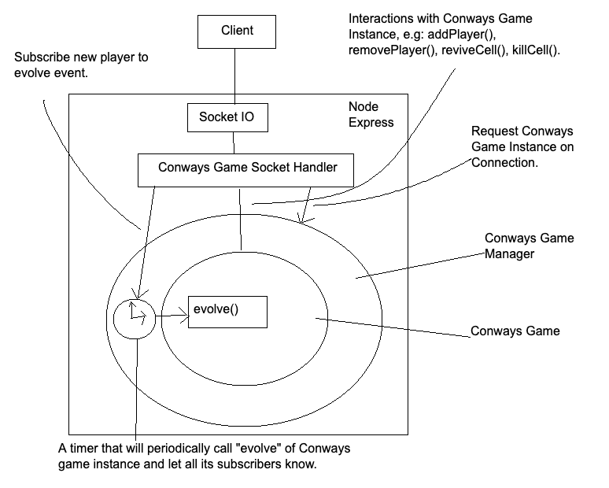

# Conways Game of Life Server

This is our server-side app of the Conways Game of Life.

It is being hosted on [https://cgof-server-2022.herokuapp.com/](https://cgof-server-2022.herokuapp.com/), but you can't see it by directly accessing it since it's an API server.

For complete demo, please visit [https://conways-game-of-life-2022.vercel.app/](https://conways-game-of-life-2022.vercel.app/), and its source code [here](https://github.com/DumDumGeniuss/conways-game-of-life-client-2022).

## Game Rules

1. Basic Conways Game of Life rules applied, check this [wiki page](https://en.wikipedia.org/wiki/Conway%27s_Game_of_Life).

2. When a cell revived, the color will be the **"average color of all colors of live neigbours"**, and those neigbours all become its parents.

3. Players can revive dead cells and become their only parents.

4. Players can kill the cells if you're parents or ancestors of the cell, you can't kill the cells that are not your descendents.

## Todo List

### Logging system

We don't have a good logging system yet, will need to implement a mechanism to allow us to collect logs from servers and put them somewhere.

### Save Game Progress

Currenltly the game is saved in memory, which means when you restart the server, the game progress will lose.

We have to save it in database, and impelment mechanisms to be able to restore the game progress while people continue the previous game.

### Distrubuted System

Our Conways game is currently managed by the ConwaysGame object, which means a gmae can only be hosted in one server.

If we have multiple servers, we have to either direct players to the server where their game is hosted or put the game in a cache that can be accessed by all servers.

## Implementation

We have two classes **ConwaysGame** and **ConwaysGameManager** and one **conways-game** socket handler.

And this is the diagram indicating how they interact with each other.



### ConwaysGame Class

Check this for [more details](./src/libs/conways-game/README.md).

A class that manages a Conways Game, it does the following things:

1. Initialize a Conways game with given size. By default, all cells are dead cells.

2. Add or remove players from the game.

3. Generate next generation of cells.

4. Allow us to interface the ecosystem, e.g: Revive a cell, kill a cell.

### ConwaysGameManager Class

Check this for [more details](./src/libs/conways-game-manager/README.md).

A class the consumes a ConwaysGame instance and do the following things:

1. Provide ConwaysGame instace to a new player upon a new socket connection.

2. Periodically call **"evolve()"** method of ConwaysGame instance, so we have an universal timer of the evoluation of a Conways game.

3. Subscribe players to the evolution of a ConwaysGame instance, so all our clients can receive the event at nearly the same time (though latency of internet is inevitable), to better synchronize the game processes of all clients.

### Conways Game Socket Handlers

Check this for [more details](./src/socket-handlers/conways-game/README.md).

This handler is in charge of managing an entire socket seesion of our clients, it does:

1. Authenticate users.

2. Receive requested actions from client and call the corresponding methods of ConwaysGame instance, then braodcast the change to other clients when needed, e.g: "revive_cell", "kill_cell", "disconnect".

3. Trigger events to clients, so client can do the corresponding actions on their end, e.g: "game_started", "logged", "player_left", "cell_updated", "board_updated",

## Challenging Issues

### Latency

The server is currently hosted on U.S (Heroku), so the latency is huge.

Our current solution is:

1. When players click a cell, we update the cell status on client side, and send a request to server.

2. When server recives the request, it will do the corresponding action (revive, kill), and braodcast "cell_updated" events to all clients, so the chagnes are updated on other clients as well.

3. Beside "2", the server will periodically emit "board_updated" event, to synchronize all clients with latest board, to avoid any inconsistency caused by lagging of intertnet.

Pops:

- Change is instant, you don't need to wait for next tick to see other players' actions.

Cons:

- Your actions can be fallbacked quite often when the latency is high.

Proposed solution:

1. Move server to somewhere near the target players.

2. When latency is low enough, we can try not doing instant changes on client, instead we just wait for server to trigger "cell_updated" or "board_updated" event.

### Race condition

Race condition is a huge concern here, if it happenes, it could crash the logic of the game and perhaps also crash the app.

Our current solution for rece condition is:

1. Keep single game in an single node process, since node.js is running in single thread, so we can avoid race condition.

2. Have a class that manages the entire game, so if unfortunately we encounter rece condition issue later on, we can delete this tricky work to this class, without us worrying about it.

Props:

- Can encapsulate all logic regarding a Conways game in a single Class.

Cons:

- In distributed system, we're gonna implement a mechanism that connets a player to the server hotsing the game they're joining.

Proposed solution:

1. Have an universal place for caching the game pogress (e.g: Reddis).

2. Have a dedicated server separated from socket server, which only in charge of generating the Conways games' generations and save them in cache.

3. When a player connects to the server, the server will get the game pogress in universal cache.

4. When a player requests to perform an action to the server, the server will put the action in a queue, then our dedicated server will perform those actions before generating next generation.

## Deployment Guide

### Env Variables

| Env Variable Name | Description                                                                                         | Required |
| ----------------- | --------------------------------------------------------------------------------------------------- | -------- |
| CLIENT_URL        | The client url, set this one correctly, otherwise we will have CORS issue, e.g: https://example.com | Yes      |
| SECRET_KEY        | The key we use to generate and validate auth tokens.                                                | Yes      |

### Start the server

```bash
yarn
yarn build
yarn start
```

### Deploy on Heroku

Already setup, you can deploy to Heroku by following this [guide](https://devcenter.heroku.com/articles/git).

```bash
heroku git:remote -a your-heroku-app-name
heroku config:set CLIENT_URL=https://example.com SECRET_KEY="hello_world"
git push heroku main
```

## Development

### Install packages

```bash
yarn
```

### Develop

Develop with hot-reload enabled.

```bash
yarn dev
```

### Build

This will compile Typescript and generate Javascript in **/dist** folder.

```bash
yarn build
```

### Start Server

Build and start the server.

```bash
yarn start
```

### Unit Tests

Run all unit tests.

```bash
yarn test
```

Or build unit tests whiling watch it.

```bash
yarn test:watch
```

### Lint Checks

```bash
yarn lint
```

### Pre Commit Hook

Please make .husky/pre-commit executable

```bash
chmod +x .husky/pre-commit
```
